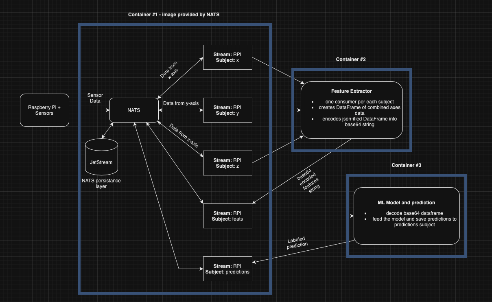

# Raspberry Pi HAR app
## Architecture



### Components
Because of ease of use and scalability, as well as potential for future HA mechanisms (e.g. deploying the application on Kubernetes) our team decided to use microservices architecture. Application consists of four main components:

1. Raspberry Pi equipped with **LSM6DS3TR-C + LIS3MDL 9DOF IMU** and pre-installed data gathering script.
2. **NATS** server with **JetStream** persistance layer acts as a message broker, enabling communication between each of the microservices.
3. **FeatureExtracor** container consumes data from NATS streams and computes signals' characteristic features.
4. **ML Model and prediction** container consumes data from `feats` stream and turns it into highly-accurate human activity prediciton.

### Raspberry Pi + Sensors
Script located in the `rpi-site` directory gathers data from accelerometer and transforms it into format suitable for our model (data should be expressed as a fraction of Earth's gravitational acceleration).

Raspberry Pi starts gathering the data, transforms it and sends it to a subject corresponding to each axis.

### NATS
From NATS website:

```txt
NATS is a connective technology built for the ever increasingly hyper-connected world. It is a single technology that enables applications to securely communicate across any combination of cloud vendors, on-premise, edge, web and mobile, and devices. NATS consists of a family of open source products that are tightly integrated but can be deployed easily and independently. NATS is being used globally by thousands of companies, spanning use-cases including microservices, edge computing, mobile, IoT and can be used to augment or replace traditional messaging.

The NATS Server acts as a central nervous system for building distributed applications. Official clients are available in Go, Rust, JavaScript (Node and Web), TypeScript (Deno), Python, Java, C#, C, Ruby, Elixir and a CLI in addition to 30+ community-contributed clients. Real time data streaming, highly resilient data storage and flexible data retrieval are supported through JetStream , the next generation streaming platform built into the NATS server.
```

In our case, NATS acts as a message broker connecting Raspberry Pi and each of the microservices. Data from Raspberry Pi is stored in three subjects: `x`, `y` and `z` each corresponding data gathered from each axis. Features extracted from signals are stored in `feats` subject and final activity predicitons for each window - in `predictions`.

Using subjects as queues ensures that all the data will be consumed by FeatureExtractor and fed the ML model.

### FeatureExtractor
To feed our ML model, we need to extract characteristic features from the gathered data. 

FeatureExtractor consumes signals from each axis, computes the features and sends pandas DataFrame in form of base64-encoded json to `feats` subject. Container containing ML model will consume the last feature message and reconstruct the DataFrame.

### ML Model and prediction
After consumption of the feature message, the message will be used to reconstruct DataFrame containing features. Our highly-accurate ML will be fed with this data and will output predicted activity. Then, this data will be send to `predicitons` subject.

Storing predicted data in NATS subject makes it easy to further use predicted activity for e.g. web applications or sending user notifications.

## Deployment
There will be scripts to automate all the steps listed below in the future.

### Raspberry Pi
Start with the following steps:

- Make sure to use `Raspberry Pi OS Lite (32-bit) Release: 2023-05-03`,
- Equip your RPi *LSM6DS3TR-C + LIS3MDL 9DOF IMU sensor*,
- Enable *I2C* interface on your RPi. Example tutorial can be found here: [link](https://www.raspberrypi-spy.co.uk/2014/11/enabling-the-i2c-interface-on-the-raspberry-pi/),
- Be sure to install all updates using `apt`,
- Set your Git credentials on RPi.


If you have successfully completed prerequisites, you may run the following commands:

```bash
# clone the repo 
git clone https://github.com/Michal148/project-HAR.git

# change branch to RPI-dev
git checkout RPI-dev

# change to correct directory 
cd rpi/rpi-site

# be sure to insert token and NATS address in the script
vi PubDataNATS.py

# install dependencies
pip install -r requirements.txt

# run the script in the background, log all to RPI-data.log file
nohup python3 PubDataNATS.py > RPI-data.log 2>&1 &
```

### NATS
To complete this and the following steps you will need to install Docker. 

To start with, download and run the NATS container:

```bash
# be sure to insert the auth token
docker run -d --name nats --network nats --rm -p 4222:4222 -p 8222:8222 nats --http_port 8222 -js --auth <insert auth token here>
```

This command will download NATS image and run NATS container with the following parameters:

- container is ran in detached mode,
- container name is *nats*,
- container will use virtual network *nats*
- container will be removed after being stopped,
- container will expose ports *4222* and *8222* and will use the latter for handling http requests,
- container will have JetStream enabled,
- container will require authentication token provided by you.

After successful container start, you will need to create before-mentioned subjects. To do that, install `nats-cli` using `brew`:

```bash
brew tap nats-io/nats-tools
brew install nats-io/nats-tools/nats
```

Other installation methods can be found here: [link](https://github.com/nats-io/natscli#installation). Installing from source requires Go installed on your machine.

Now, to create stream and subjects run:

```bash
nats str add --user=<your auth token here>
```

You will have to insert the following values in interactive mode:

```bash
? Stream Name RPI
? Subjects x,y,z,feats,predictions
? Storage file
? Replication 1
? Retention Policy Limits
? Discard Policy Old
? Stream Messages Limit -1
? Per Subject Messages Limit -1
? Total Stream Size -1
? Message TTL 5m
? Max Message Size -1
? Duplicate tracking time window 2m0s
? Allow message Roll-ups No
? Allow message deletion Yes
? Allow purging subjects or the entire stream Yes
```

That concludes NATS setup.

### FeatureExtractor
To start with, be sure to have Docker installed and repository cloned.

```bash
# checkout to RPI-dev branch
git checkout RPI-dev

# change to correct directory
cd rpi/feature-extractor

# build the image (this can take a while)
docker build -t feature_extractor:1.0 .
```

Having built the image, you may start the container with FeatureExtractor. Be sure to input your auth token for NATS and NATS container name:

```bash
docker run --network nats feature_extractor:1.0 -e NATS_TOKEN='your_auth_token_here' -e NATS_ADDRESS='nats_container_name_here'
```

This will NOT run the container in the detached mode. You will see outputs of the script in your terminal. 

**For container to work properly, NATS container must be started first!**
