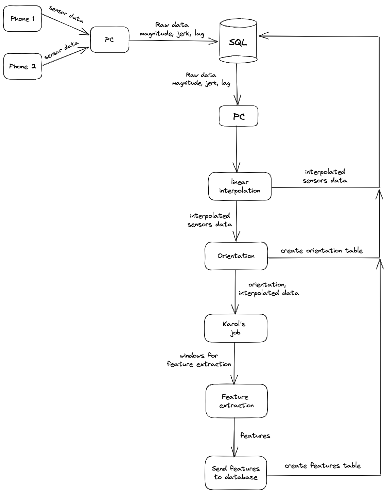

# Features
Each team member was assigned creation of feature sets selected from various state-of-the-art academic papers, which could be found in the `Michał`, `kasper`, `karol` and `wiktor` directories. The table below summarizes created features and contains necessary DOIs to access papers.

## Features summary
|File path|Feature name|DOI|
|---|---|---|
|`./Michał/Characteristics.py`| Kurtosis | `10.3390/s21030692`|
||Zero crossing|`10.3390/s21030692`|
||Correlation coefficient|`10.3390/s21030692`|
||Entropy|`10.3390/s21030692`|
||Cross correlation between axes|`10.1109/SMC.2015.263`|
||Magnitude|`10.1186/s13673-017-0097-2`|
||Median absolute deviation|`10.1007/978-0-387-32833-1_261`|
|`./karol/feats.py`|Mean value|`10.3390/s21030692`|
||Standard deviation|`10.3390/s21030692`|
||Root mean square value|`10.3390/s21030692`|
||Interquartile range|`10.3390/s21030692`|
||Energy|`10.3390/s21030692`|
||Mean Power frequency|`10.3390/s21030692`|
||One quarter of frequency|`10.3390/s21030692`|
||Three quarters of frequency|`10.3390/s21030692`|
|`./kasper/feats.py`|Skewness|`10.3390/s21030692`|
||Peak to peak|`10.3390/s21030692`|
||Mean absolute value|`10.3390/s21030692`|
||Waveform detector|`10.3390/s21030692`|
||Jerk|`10.3390/s21030692`|
||Haar filters|`10.1109/DSP.2009.4786008`|
||FFT from jerk|`10.1186/s13673-017-0097-2`|
|`./wiktor/feats.py/`|Slope sign change|`10.3390/s21030692`|
||Wilson Amplitude|`10.3390/s21030692`|
||4th order largest value of DFT|`10.3390/s21030692`|
||Energy wavelet coefficient|`10.3390/s21030692`|
||FFT from Magnitude|`10.1186/s13673-017-0097-2`|
||Auto-regression coefficients with Burg order equal to four correlation coefficients between two signals|`10.1186/s13673-017-0097-2`|
||Signal lag| - |

## Orientation
Additionally, to measure our mobile phones' orientation in space, we have implemented a quaternion-based filter for our MARG data gathered during performed activities. Our code was based on steps from [Keeping a Good Attitude: A Quaternion-Based Orientation Filter for IMUs and MARGs (DOI: 10.3390/s150819302)](https://www.mdpi.com/1424-8220/15/8/19302).

## createTable.py
`createTable.py` is a Python script created for pushing raw data from MARG sensors to a SQL database. It uses `pyodbc` for database connection and data manipulation. Firstly, the script creates new tables with all raw data columns and additional *magnitude*, *lag* and, in accelerometer case, *jerk* columns. After successful table creation it uses *executemany* method to quickly insert all the data from `.csv` files. The process' steps are shown below:

1. Create seperate directory for each performed test. Name of the files stored in it will be used to create `.csv` files' tables.
2. Read env variables necessary to open DB connection.
3. Loop through each directory in `streaming-work-dir` and create lists with its contents.
4. Open connection to database: for each file create a new table. If name of the read file has `ccel` string in it, add additional columns to store jerk data.
5. Compute magnitude, lag and, if necessary, jerk data. Start inserting data into table.
6. Repeat until all the data has been pushed to the database.

## interpolation.py
During our tests, data gathered from accelerometer, gyroscope and magnetometer sensors turned out not to be in an ideal sync. To solve this problem we've come up with a short function, which uses `PchipInterpolator` from `scipy.interpolate` module. Function takes three arguments (accelerometer, gyroscope and magnetometer dataframes with raw sensor data) and returns dataframe with interpolated data in 0.01s intervals with *magnitude*, *lag* and in case of accelerometer - *jerk* columns.

## Feature extraction pipeline
